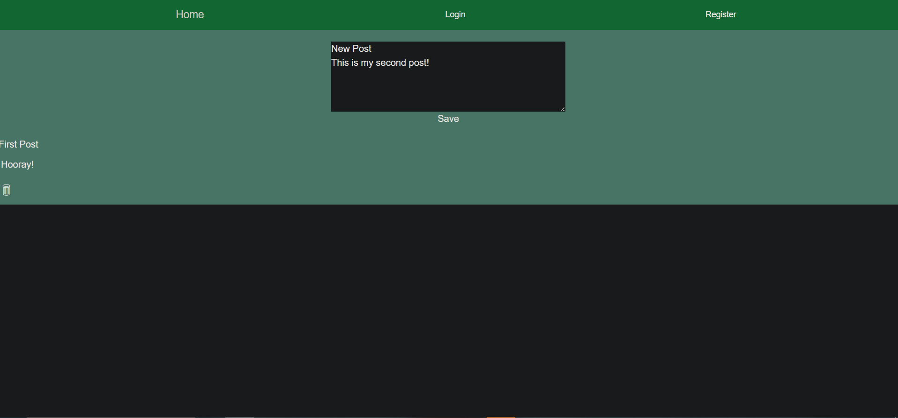
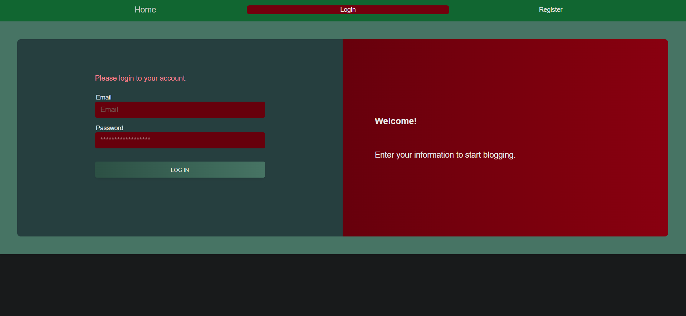
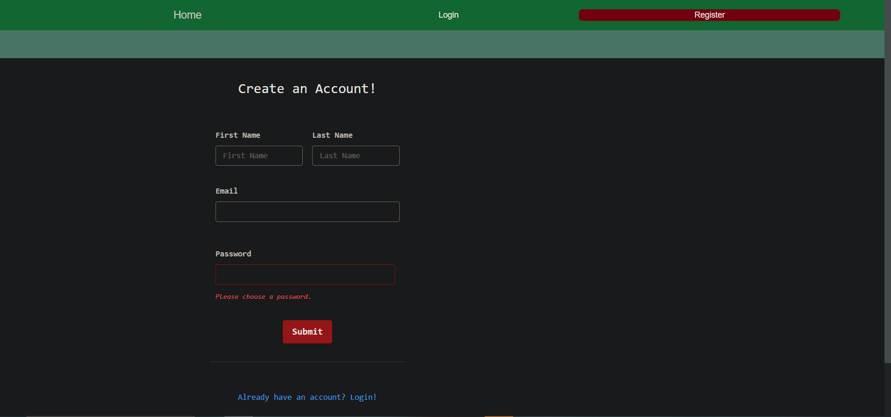

# Blog_Site

## Repo Link

https://github.com/matthewlazarowitz/Blog_Site

## Screenshot

## Heroku Link
https://drive.google.com/file/d/1jnvdbSSHNrRW7la3EE5FPnfxPhYtFmnn/view

## Description

In this challenge, we were tasked to construct a powerful blog site from scratch that'll remind you of platforms like WordPress. Here, we can publish our tech ideas. The site is guided by the Model-View-Controller (MVC) paradigm, making use of technologies like Handlebars.js for rendering, Sequelize for database interaction, and the express-session npm package for secure user authentication.  This assignment isn't just about coding; it's about understanding how applications are structured, how data flows, and how users interact with the technology we build.  Dive into the world of content creation! Craft your articles, blog posts, and thoughts on the dashboard! 

## Installation

N/A

## Usage

 I had the exciting opportunity to immerse myself in the world of tech blogging by creating a robust CMS-style blog site from scratch.The task was to build a platform where developers like me could publish articles, thoughts, and dive into vibrant discussions. The Model-View-Controller (MVC) paradigm set the stage, with Handlebars.js for rendering, Sequelize for database wizardry, and express-session for fortifying security.  This isn't just about building a tech blog; it's about understanding application architecture, data flow, and user interactions. Through the challenges of this assignment, I've gained more than just coding skills; I've learned how to create meaningful user experiences.

## Credits

(JD Tadlock)  (RUT-VIRT-FSF-FT-05-2023-U-LOLC)

## License

MIT License

Copyright (c) 2023 matthewlazarowitz

Permission is hereby granted, free of charge, to any person obtaining a copy
of this software and associated documentation files (the "Software"), to deal
in the Software without restriction, including without limitation the rights
to use, copy, modify, merge, publish, distribute, sublicense, and/or sell
copies of the Software, and to permit persons to whom the Software is
furnished to do so, subject to the following conditions:

The above copyright notice and this permission notice shall be included in all
copies or substantial portions of the Software.

THE SOFTWARE IS PROVIDED "AS IS", WITHOUT WARRANTY OF ANY KIND, EXPRESS OR
IMPLIED, INCLUDING BUT NOT LIMITED TO THE WARRANTIES OF MERCHANTABILITY,
FITNESS FOR A PARTICULAR PURPOSE AND NONINFRINGEMENT. IN NO EVENT SHALL THE
AUTHORS OR COPYRIGHT HOLDERS BE LIABLE FOR ANY CLAIM, DAMAGES OR OTHER
LIABILITY, WHETHER IN AN ACTION OF CONTRACT, TORT OR OTHERWISE, ARISING FROM,
OUT OF OR IN CONNECTION WITH THE SOFTWARE OR THE USE OR OTHER DEALINGS IN THE
SOFTWARE.

